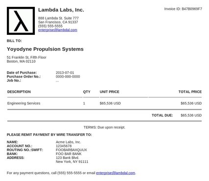

envois
======

Automated invoicing by Lambda Labs, Inc.

## Requirements
- jinja2
- pdflatex (if generating pdfs from latex template)

## Example Output

Here's a screenshot of a PDF file created using the HTML generated by envois.



## Example 

Currently the envois script and example json file exist in the
scripts directory. 

```bash
./scripts/envois < scripts/test.json > output.html
```

or

```bash
./scripts/envois -i scripts/test.json -o output.html
```

Open the resulting HTML in a browser, save it as a PDF, give it to the people
who owe you money.

For more options on how to use envois:

```bash
usage: envois [-h] [-i INPUT_FILE] [-l] [-o OUTPUT_FILE]

optional arguments:
  -h, --help            show this help message and exit
  -f INPUT_FILE, --file INPUT_FILE
                        the json file used to generate invoice
  -l, --latex           use latex template to render invoice, default is to
                        use html
  -o OUTPUT_FILE        output file name, default is printing to stdout
```

### Example invoice file

```json
{
    "seller": {
        "name": "Lambda Labs, Inc.",
        "address": {
            "street": "888 Lambda St. Suite 777",
            "city": "San Francisco",
            "state": "CA",
            "zipcode": "91337",
            "email": "enterprise@lambdal.com",
            "phone": "(555) 555-5555"
        },
        "account": {
            "bank": "FOO BAR BANK",
            "swift": "FOOBARBAXQUUX",
            "number": "12345678",
            "name": "Acme Labs, Inc.",
            "same_address": false,
            "address": {
                "street": "123 Bank Blvd.",
                "city": "New York",
                "state": "NY",
                "zipcode": "91111"
            }
        },
        "logo": "http://lambdal.com/images/lambda-labs-logo.png"
    },
    "buyer": {
        "name": "Yoyodyne Propulsion Systems",
        "address": {
            "street": "51 Franklin St, Fifth Floor",
            "city": "Boston",
            "state": "MA",
            "zipcode": "02110"
        }
    },
    "items": [
        {
            "description": "Engineering Services",
            "qty": 1,
            "unit_price": 65536.00
        }
    ],
    "terms": {
        "days": 0,
        "string": "Due upon receipt."
    },
    "date_of_purchase": "2013-07-01",
    "purchase_order_no": "0000-000-0000",
    "job_no": "..."
}
```

## Generated invoice contents

- Your company's logo
- Your company's address
- Your company's billing information
- Invoice date
- Invoice number
- Description and qty of goods
- Terms: NET X DAYS "INTEREST CHARGE ASSESSED ON BALANCES OVER X DAYS"

## LaTeX rendering options

Note: LaTeX invoice template taken from [www.latextemplates.com]
